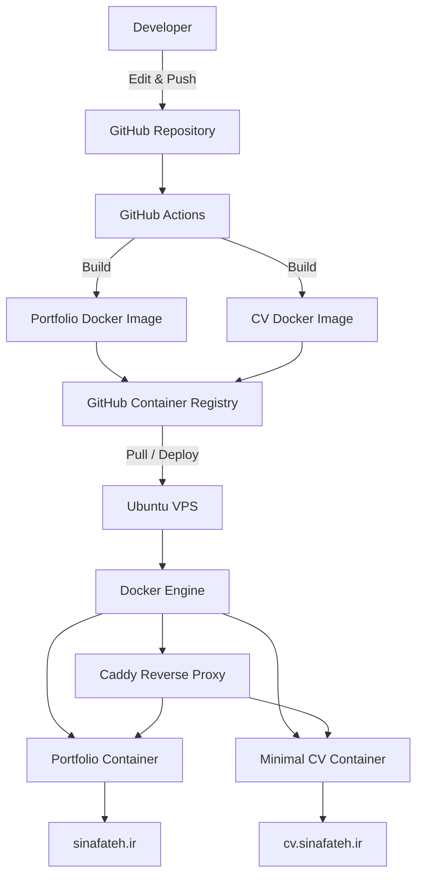
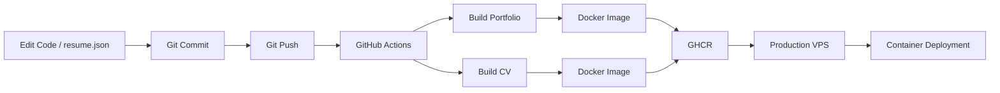
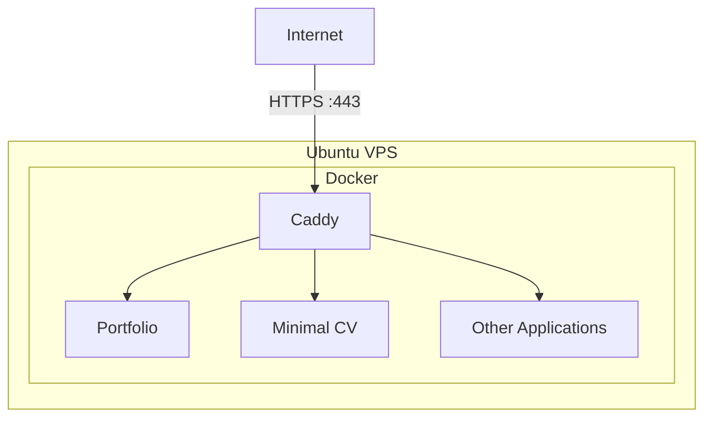

# Resume Platform

A self-hosted, containerized resume and portfolio platform built around a **single source of truth**.

The project contains two independent Astro-based frontends — a full portfolio website and a minimal CV — both powered by the same `resume.json` data source.

Changes are built and deployed through an automated Docker-based CI/CD pipeline.

## Live

- **Portfolio:** https://sinafateh.ir
- **Minimal CV:** https://cv.sinafateh.ir
- **GitHub:** https://github.com/cnafateh/resume-platform

---

## Overview

I originally built two different versions of my personal website:

- a full portfolio for presenting my background, skills, projects, experience, and certificates
- a minimal CV focused on quickly presenting professional information

Maintaining the same resume information independently in both applications quickly became unnecessary duplication.

The solution was to move both applications into a single repository and use one structured JSON file as their shared data source.

```text
                    resume.json
                         │
                ┌────────┴────────┐
                │                 │
                ▼                 ▼
        Portfolio Website     Minimal CV
             Astro               Astro
```

This later evolved into a complete self-hosted deployment setup using Docker, GitHub Actions, GitHub Container Registry, an Ubuntu VPS, Caddy, and container lifecycle management.

---

## Architecture

The platform is divided into three main layers:

1. **Application layer** — two independent Astro frontends
2. **CI/CD layer** — GitHub Actions and GitHub Container Registry
3. **Infrastructure layer** — Docker-based deployment on a self-managed Ubuntu VPS



---

## Single Source of Truth

Both applications consume the same root-level:

```text
resume.json
```

It contains structured resume information such as:

```text
Personal Information
Experience
Education
Skills
Projects
Certificates
Social Links
```

The two applications decide independently how that information should be presented.

This separates **resume content** from **presentation**.

```text
                         resume.json
                              │
             ┌────────────────┴────────────────┐
             │                                 │
             ▼                                 ▼
      Portfolio Renderer                 CV Renderer
             │                                 │
             ▼                                 ▼
      Rich presentation                 Minimal layout
```

As a result, updating a certificate, skill, project, or work experience only requires changing one file.

---

## Repository Structure

```text
resume-platform/
│
├── resume.json
├── compose.yaml
├── .dockerignore
├── .gitignore
├── README.md
│
├── apps/
│   │
│   ├── portfolio/
│   │   ├── src/
│   │   ├── public/
│   │   ├── package.json
│   │   ├── package-lock.json
│   │   └── Dockerfile
│   │
│   └── cv/
│       ├── src/
│       ├── public/
│       ├── nginx/
│       ├── package.json
│       ├── package-lock.json
│       └── Dockerfile
│
└── .github/
    └── workflows/
        └── build-images.yml
```

---

## Applications

### Portfolio

The primary website provides a more visual and interactive representation of my professional profile.

It includes sections for:

- About
- Work experience
- Skills
- Projects
- Certificates
- Contact information

The interface also supports responsive layouts and light/dark appearance modes.

**Live:** https://sinafateh.ir

### Minimal CV

The second frontend provides a simpler representation of the same underlying resume data.

It is intended for visitors who prefer a concise, CV-oriented presentation.

**Live:** https://cv.sinafateh.ir

---

## Tech Stack

### Frontend

- Astro
- TypeScript
- HTML
- CSS
- JavaScript

### Containerization

- Docker
- Docker Compose
- Multi-stage Docker builds
- Nginx

### Infrastructure

- Ubuntu Linux VPS
- Docker Engine
- Caddy
- Docker networking
- UFW

### CI/CD

- Git
- GitHub
- GitHub Actions
- GitHub Container Registry (GHCR)

### Operations

- Arcane
- Docker Compose project management
- Container logs and lifecycle management
- Container image update management

---

## Docker Architecture

Each application is built as an independent Docker image.

The builds use a multi-stage approach:

```text
┌─────────────────────────┐
│      Node.js Stage      │
│                         │
│ npm ci                  │
│ Astro build             │
│ generate /dist          │
└────────────┬────────────┘
             │
             ▼
┌─────────────────────────┐
│       Nginx Stage       │
│                         │
│ Copy static build       │
│ Serve production files  │
└─────────────────────────┘
```

This keeps the final production containers independent from the Node.js development environment.

The resulting architecture is:

```text
Portfolio source
      │
      ▼
Astro build
      │
      ▼
Static files
      │
      ▼
Nginx container


CV source
      │
      ▼
Astro build
      │
      ▼
Static files
      │
      ▼
Nginx container
```

---

## CI/CD Pipeline

The repository uses GitHub Actions to build and publish the applications.

The deployment workflow is designed around container images rather than transferring application source code directly to the production server.



The resulting development workflow is intentionally simple:

```text
Edit
  ↓
Commit
  ↓
Push
  ↓
Build
  ↓
Publish
  ↓
Deploy
```

GitHub Actions builds separate images for the two applications and publishes them to GitHub Container Registry.

Images are published using both a rolling tag and an immutable commit-based tag.

Example:

```text
ghcr.io/cnafateh/resume-portfolio:latest
ghcr.io/cnafateh/resume-cv:latest
```

Commit SHA tags provide a known deployment version that can also be used for rollback.

---

## Production Infrastructure

The applications run on a self-managed Ubuntu VPS.

The server hosts multiple isolated Docker Compose projects and uses a shared reverse-proxy network.

Conceptually:



Application containers do not need to expose their HTTP ports directly to the public internet.

Instead, Caddy communicates with them through a Docker network.

This makes it possible to add future applications without exposing additional application ports publicly.

---

## Reverse Proxy & HTTPS

Caddy acts as the public entry point for web traffic.

Its responsibilities include:

- domain-based routing
- reverse proxying
- TLS certificate management
- HTTPS termination
- HTTP to HTTPS redirection

Conceptually:

```text
Internet
    │
    │ HTTPS
    ▼
  Caddy
    │
    ├──────────────► Portfolio
    │
    ├──────────────► Minimal CV
    │
    └──────────────► Future Services
```

This allows multiple containerized applications to share the same VPS while remaining independently deployable.

---

## Network Model

Only required infrastructure ports are exposed publicly.

```text
Internet
   │
   ├── 22   SSH
   ├── 80   HTTP
   └── 443  HTTPS
            │
            ▼
          Caddy
            │
      Docker Network
       ┌────┴────┐
       │         │
       ▼         ▼
   Portfolio     CV
```

Application containers communicate internally using Docker networking rather than public host ports.

---

## Server Security

The production server follows several basic hardening practices.

### SSH

- dedicated non-root administrative account
- SSH key-based authentication
- direct root SSH login disabled
- password-based SSH authentication disabled
- reduced authentication attempts

### Firewall

UFW is configured with a default-deny inbound policy.

Only required public services are exposed:

```text
22/tcp
80/tcp
443/tcp
```

### Containers

Application containers are not directly exposed to the public internet.

Public HTTP traffic enters through Caddy and is routed internally through the Docker network.

### Secrets

Sensitive production information is kept outside the source repository.

The repository must never contain:

- SSH private keys
- Personal Access Tokens
- registry credentials
- JWT secrets
- encryption keys
- production passwords
- `.env` files containing secrets

---

## Local Development

Clone the repository:

```bash
git clone https://github.com/cnafateh/resume-platform.git
cd resume-platform
```

### Docker

Build the applications:

```bash
docker compose build
```

Start the stack:

```bash
docker compose up -d
```

Check running containers:

```bash
docker compose ps
```

Stop the applications:

```bash
docker compose down
```

To rebuild after changes:

```bash
docker compose up -d --build
```

---

## Running an Application Directly

Each frontend can also be developed independently.

For example:

```bash
cd apps/portfolio
npm install
npm run dev
```

Or:

```bash
cd apps/cv
npm install
npm run dev
```

Astro will start its local development server and display the local address in the terminal.

---

## Updating Resume Content

Most resume changes only require editing:

```text
resume.json
```

For example, certificates are represented as structured data:

```json
{
  "name": "Cisco CCNA Training",
  "issuer": "Arjang Institute of Higher Education",
  "date": "2026",
  "status": "Enrolled"
}
```

After updating the resume:

```bash
git add resume.json
git commit -m "Update resume"
git push
```

The CI/CD pipeline handles rebuilding and publishing the applications.

---

## Deployment Strategy

Production deployments are image-based.

The VPS consumes pre-built images from GHCR rather than building the application source directly on the production server.

```text
Source Code
     │
     ▼
GitHub Actions
     │
     ▼
Docker Build
     │
     ▼
GHCR
     │
     ▼
Production Pull
     │
     ▼
Container Deployment
```

This keeps build responsibilities outside the production environment and makes deployments more reproducible.

---

## Rollback Strategy

Container images are published with commit-specific tags in addition to `latest`.

Conceptually:

```text
resume-portfolio:latest

resume-portfolio:<commit-sha>
resume-cv:<commit-sha>
```

If a deployment introduces a problem, a previously known working image can be selected and redeployed without rebuilding the application.

This provides a straightforward rollback path.

---

## Container Management

Arcane is used as a management layer for the Docker environment.

It provides a web interface for operational tasks such as:

- viewing containers
- inspecting logs
- managing Docker Compose projects
- restarting services
- checking container status
- managing image updates
- redeploying applications

The management interface is intentionally not linked publicly from this repository.

---

## Adding Future Applications

The VPS architecture is designed to support more than the two resume applications.

A future application can be introduced as an independent Docker Compose project.

Typical process:

```text
Application
    ↓
Dockerfile
    ↓
Docker Image
    ↓
Compose Service
    ↓
Proxy Network
    ↓
Caddy Route
    ↓
Domain
```

This allows new services to be deployed without coupling them to the existing resume applications.

---

## Design Decisions

### Why one `resume.json`?

The two websites represent the same person and therefore should not maintain independent copies of resume information.

Using one data source eliminates duplicated content updates.

### Why two separate frontends?

The applications serve different presentation goals.

The portfolio focuses on visual presentation and exploration, while the minimal CV focuses on fast access to professional information.

Sharing data does not require sharing presentation.

### Why Docker?

Docker provides reproducible application environments and keeps each application isolated.

It also makes moving services between development and production environments significantly easier.

### Why GHCR?

GitHub Container Registry integrates naturally with GitHub Actions and allows deployment to operate on immutable application artifacts instead of production source builds.

### Why Caddy?

Caddy provides a simple reverse-proxy configuration while handling HTTPS certificate provisioning and renewal automatically.

### Why a VPS?

Using a self-managed VPS provided an opportunity to work directly with the infrastructure behind the applications instead of relying entirely on a managed hosting platform.

That includes Linux administration, Docker networking, DNS, reverse proxies, TLS, firewalls, container registries, and deployment workflows.

---

## Key Engineering Goals

This project was built around several principles:

**Single source of truth**

Resume information should exist in one place.

**Reproducible deployments**

Production should run pre-built container images rather than depend on manual server configuration.

**Service isolation**

Each application should be independently containerized and deployable.

**Minimal public exposure**

Only infrastructure that must be internet-facing should be publicly accessible.

**Simple updates**

Updating resume content should require as few operational steps as possible.

**Extensibility**

The infrastructure should support additional applications and domains without requiring a complete redesign.

---

## What I Learned

Although the visible result is a personal portfolio and CV, much of the work behind this project involved infrastructure and deployment engineering.

The project provided hands-on experience with:

- Linux server administration
- Docker image design
- multi-stage builds
- Docker Compose
- container networking
- reverse proxies
- DNS configuration
- HTTPS/TLS
- firewall configuration
- SSH hardening
- container registries
- GitHub Actions
- CI/CD workflows
- image-based deployments
- container lifecycle management
- rollback strategies

Most importantly, these technologies were used together as parts of one working system rather than as isolated exercises.

---

## Future Improvements

Possible future improvements include:

- more selective CI builds based on changed application paths
- dependency update automation
- automated backup workflows
- external uptime monitoring
- centralized observability
- improved deployment health checks
- automated rollback on failed health checks
- stronger supply-chain controls for CI dependencies
- additional containerized projects on the same infrastructure

---

## Author

**Sina Fateh**

Backend / Software Developer

- Portfolio: https://sinafateh.ir
- Minimal CV: https://cv.sinafateh.ir
- GitHub: https://github.com/cnafateh